<h2 align="left">Hi 👋!</h2> 
<h2 align="left">My name is S Sandhya Rani and I'm a ongoing Master's student from Indian Institute of Technology Hyderabad</h2>

###

###

  
  
  
  
  
  
  
  
  
  
  
  
  
  
  
  
  
  
  
  
  

###

  
  

###

 

#

###
